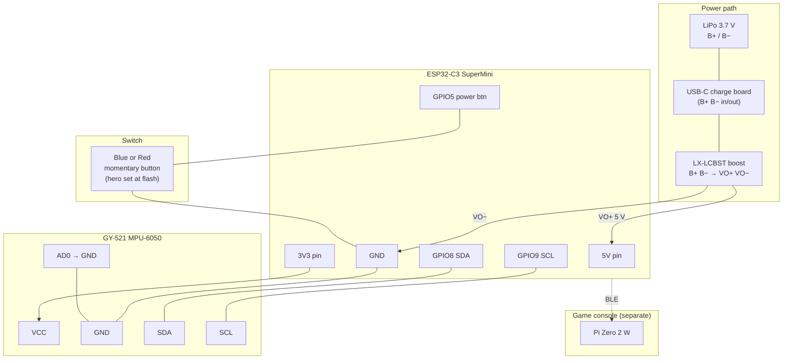
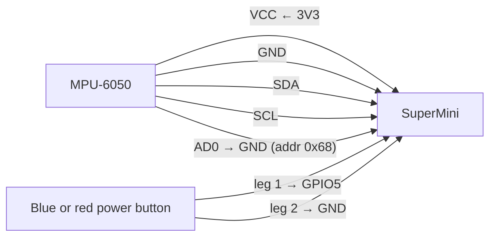
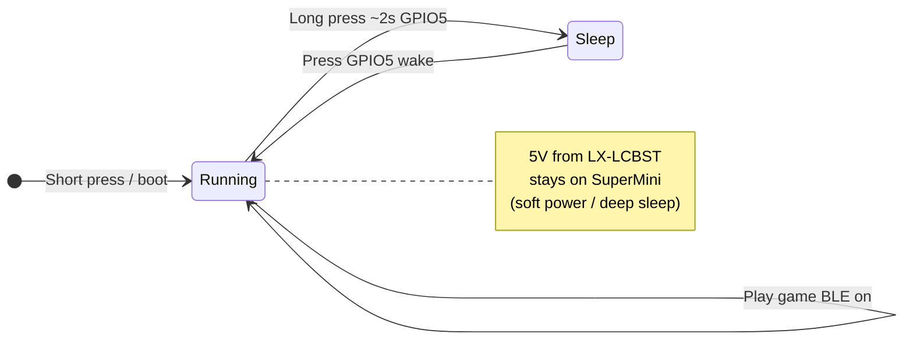
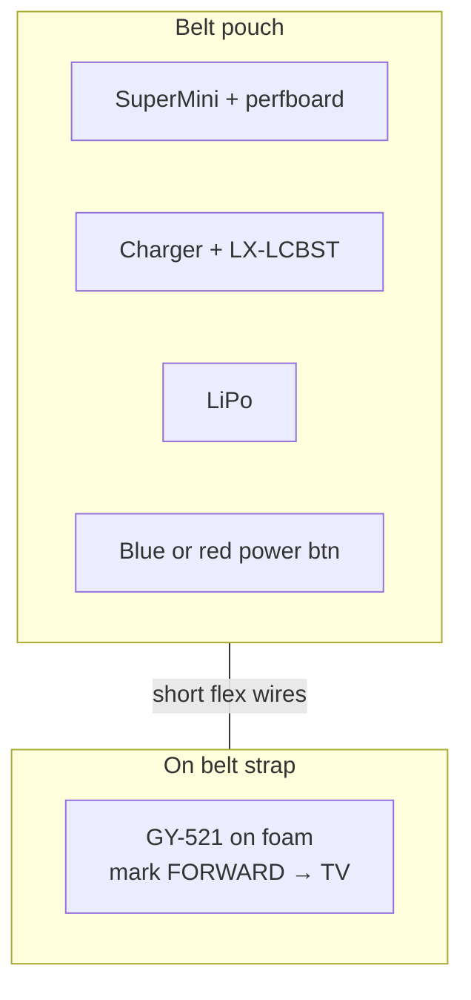

# Controller wiring (one unit)

Build **two** identical chains; MPU, power, and I2C are the same on both. The **only** hardware change vs the old plan: **remove the boy/girl rocker (GPIO4)** — keep the **same momentary button on GPIO5** (red on one unit, blue on the other).

**Legend:** Flash sets **starting** hero (**blue** unit → `make flash-blue` = boy at boot; **red** → `make flash-red` = girl). **Short press GPIO5** toggles boy/girl while playing (replaces the old rocker). **GPIO4** unused.

---

## Block diagram

---

## Signal diagram (GPIO only)

---

## Power button (do not wire in battery path)

---

## Pin table (SuperMini)

| GY-521 | → | SuperMini |
|--------|---|-----------|
| VCC | → | **3V3** |
| GND | → | **GND** |
| **SDA** | → | **GPIO8** (ESP **SDA** — not SCL) |
| **SCL** | → | **GPIO9** (ESP **SCL** — not SDA) |

**Do not cross:** ESP SDA → MPU **SDA**, ESP SCL → MPU **SCL**.  
If ESP SDA is on MPU **SCL**, the bus will NACK / scan empty — swap the two data wires.
| AD0 | → | **GND** |
| INT, XDA, XCL | | *not used* |

| Switch | → | SuperMini |
|--------|---|-----------|
| Hero / power button (blue or red cap) | → | **GPIO5** ↔ **GND** (or **GPIO4** if you reused the old rocker pads) |

| Power | → | SuperMini |
|-------|---|-----------|
| LX-LCBST VO+ | → | **5V** |
| LX-LCBST VO− | → | **GND** |

---

## Physical layout (belt clip)

---

## Open schematic

**Visual schematic**

- [wiring-schematic.svg](./wiring-schematic.svg) — fixed ASCII-only text (invalid XML chars broke preview before)
- [wiring-schematic.html](./wiring-schematic.html) — open in browser if Cursor SVG preview is blank
